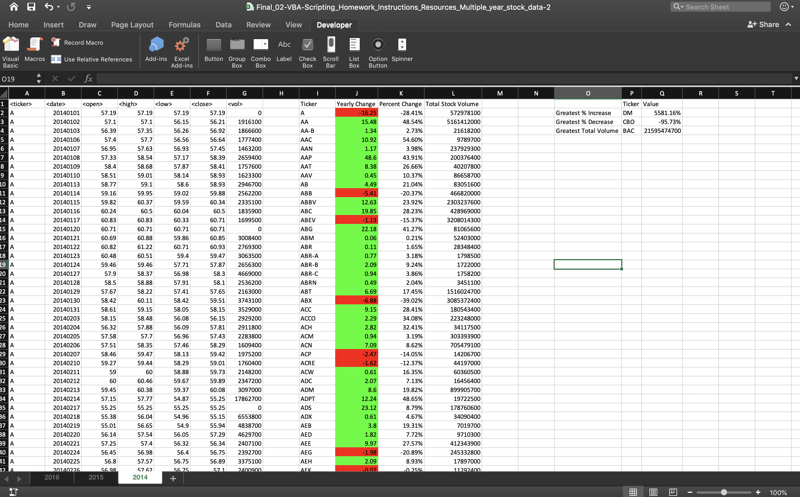
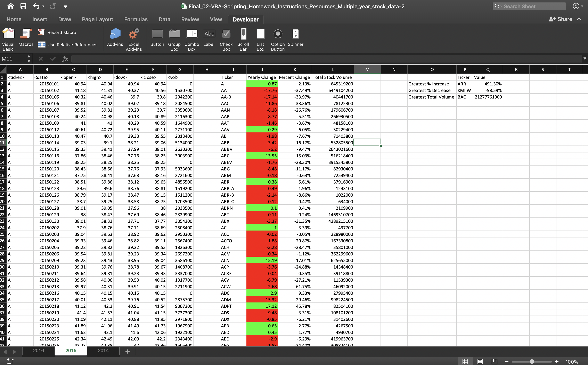
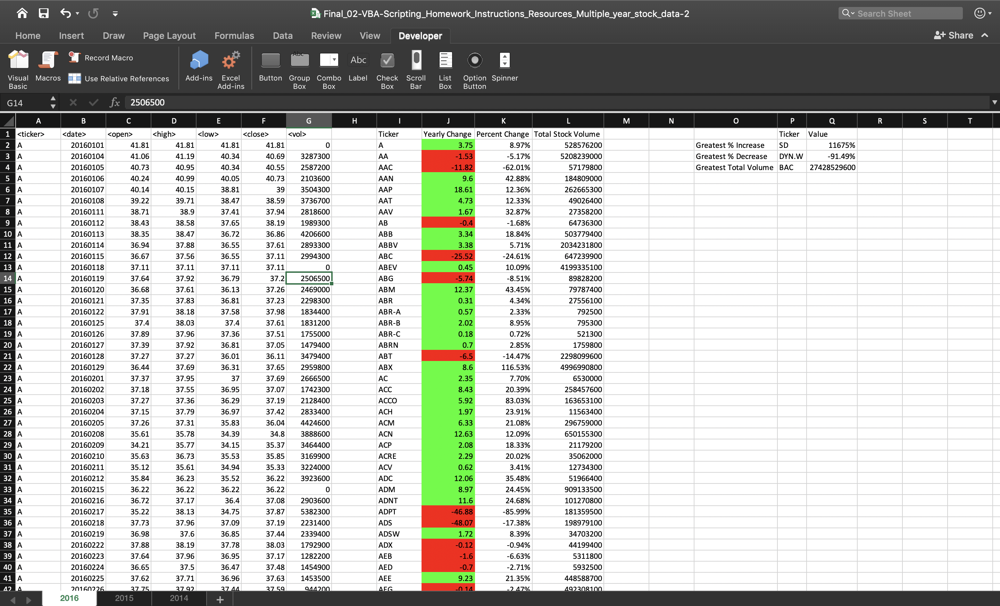

# Stock Market Analysis
Identify stock trends from 2014-2016 with VBA

## Files
Sample test file

Can provide full data set upon requests 

## Process 
Create a script that will loop through all the stocks for one year and output the following information:
- The ticker symbol
- Yearly change from opening price at the beginning of a given year to the closing price at the end of that year
- The percent change from opening price at the beginning of a given year to the closing price at the end of that year
- The total stock volume of the stock
- Conditional formatting that will highlight positive change in green and negative change in red
- Identify the stock with the "Greatest % increase", "Greatest % decrease" and "Greatest total volume" of that year
- Script should be able to run on every worksheet i.e. every year just by running the VBA script once

## Results
<b> 2014 Results </b>

<b> 2015 Results </b>

<b> 2016 Results </b>

